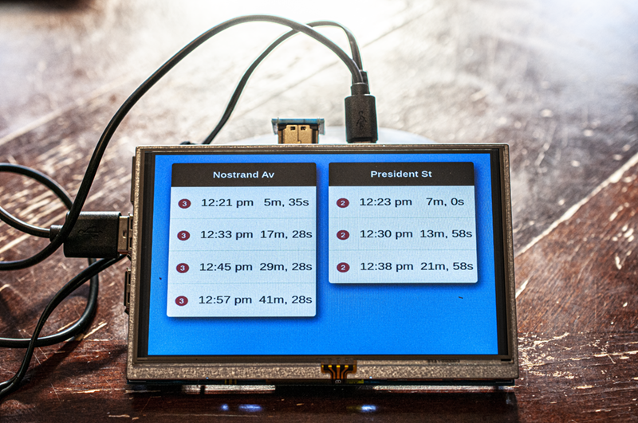
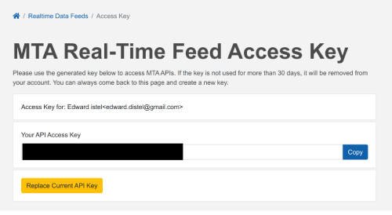

# NYC MTA Countdown Clock via Raspberry Pi

This simulates the subway countdown clocks in NYC, telling you when the next train is scheduled to arrive.

The MTA has a free app, [SubwayTime](https://apps.apple.com/us/app/mta-subway-time/id561507659), but you can only see 1 station at a time. This app lets easily pull in all the arriving train data and provides an HTML front-end for viewing two stations at the same time.

I also provide instructions on how to install this on a Raspberry Pi so you can have a dedicated countdown clock on an always-on monitor.

 

## Getting started

### Step 1: Get a free API key from the MTA

Register for a free API key from the MTA [https://api.mta.info/#/AccessKey](https://api.mta.info/#/AccessKey). It'll be a 40-character code. Write it down.




### Step 2: Clone this repo locally

`git clone git@github.com:edwarddistel/mta-countdown-clock.git` or download the zip.

### Step 3a: Decide the stations you want the data for

Open `station-data.json` and search for the name of the stations you want. E.g., "Times Square". Write down the station IDs, e.g. "725N" (for north-bound trains) or "725S" (for south-bound trains).

**NOTE**: The MTA has *different* station IDs for trains at the same station that run on different tracks. For example, at 14th St Union Square there's:

```
635 - 4,5,6
L03 - L
R20 - N,Q
```

If you want ALL the trains coming into Union Square, use all 3 station IDs and then merge the data client-side.

However if two lines run on the same track they will use the SAME station ID.

### Step 3b: Select the MTA Subway endpoint

Recently the MTA revised their API and for some reason decided to make each subway line it's own URL. So now you must also decide which subway lines you want to pull for.

My app is currently only set to read from 1 URL -- they changed this after I built it. If I have time I'll revise to meet the new structure but for now you you can only pick one of these:

[https://api.mta.info/#/subwayRealTimeFeeds](https://api.mta.info/#/subwayRealTimeFeeds):

- (A, C, E) - https://api-endpoint.mta.info/Dataservice/mtagtfsfeeds/nyct%2Fgtfs-ace 
- (B, D, F, M) - https://api-endpoint.mta.info/Dataservice/mtagtfsfeeds/nyct%2Fgtfs-bdfm
- (G) - https://api-endpoint.mta.info/Dataservice/mtagtfsfeeds/nyct%2Fgtfs-g
- (J, Z) - https://api-endpoint.mta.info/Dataservice/mtagtfsfeeds/nyct%2Fgtfs-jz
- (N, Q, R, W) - https://api-endpoint.mta.info/Dataservice/mtagtfsfeeds/nyct%2Fgtfs-nqrw
- (L) - https://api-endpoint.mta.info/Dataservice/mtagtfsfeeds/nyct%2Fgtfs-l
- (1, 2, 3, 4, 5, 6) - https://api-endpoint.mta.info/Dataservice/mtagtfsfeeds/nyct%2Fgtfs
- (7) - https://api-endpoint.mta.info/Dataservice/mtagtfsfeeds/nyct%2Fgtfs-7
- (SIR) - https://api-endpoint.mta.info/Dataservice/mtagtfsfeeds/nyct%2Fgtfs-si (???)

### Step 4: Update the .env config file

Open `.env` in your code editor to find:

```
/* Custom environment variables */
MTA_API_ENDPOINT = https://api-endpoint.mta.info/Dataservice/mtagtfsfeeds/nyct%2Fgtfs
MTA_API_KEY = xxxxxxxxxxxxxxxxxxxxxxxxxxxxxxxx
STATIONS = "725N 725S"
```

Replace the x's in the `MTA_API_KEY` with the key you wrote down in Step 1. Replace the station IDs with the numbers you wrote down in Step 3. Note the station string should remain encased in double quotes and separated by spaces, as shown. Save.

### Step 5: Test the app

[Install NodeJS](https://nodejs.org/en/download/). From your command line, navigate to the cloned directory and type:

```
npm i
npm run build
npm run start
```


Recently I've been getting some dependency check error when installing, just run `npm install --force` if you get this.

This should build a new version of the app via webpack into `dist/bundle.js` and run it:


```
MTA Countdown API live on 4000
```

Open a web browser and hit the endpoint directly at [http://localhost:4000](http://localhost:4000). You should see real data, like:

```json
{
    "stations": {
        "725N": {
            "name": "Times Sq - 42 St",
            "trains": [
                {
                "trainId": "7",
                "eta": "12:51 am",
                "minAway": "8m, 0s",
                "rawEta": 480
                },
                {
                "trainId": "7",
                "eta": "1:01 am",
                "minAway": "18m, 0s",
                "rawEta": 1080
                },
                {
                "trainId": "7",
                "eta": "1:11 am",
                "minAway": "28m, 0s",
                "rawEta": 1680
                },

```

### Step 6: Test the HTML front end

Optionally I've included an example of what a front-end to consuming this data can look like. Use this or build your own, but this example only supports two stations -- more than that it won't work. It's really for demo purposes to show you how to consume and display the data.

With the node app running in the background, fire up a web browser and open `mta-countdown-clock.html` in the `html` folder. If you're using two stations you should see:


### Step 7: Acquire Raspberry Pi and peripherals

You will need:
1. Raspberry Pi
2. AC power adapter
3. MicroSD card
4. A monitor

You can buy 1-3 separately altho I just [went with a kit for $75](https://www.amazon.com/gp/product/B01C6Q2GSY) and an [800x400 LCD for $35](https://www.amazon.com/gp/product/B072558KZ4).

Connect the monitor to the Pi, should be instructions in the box.

### Step 8: Install and configure Raspbian, the Raspberry Pi OS.

Download and install [Raspian](https://www.raspberrypi.org/documentation/installation/installing-images/).

I recommend the "Desktop with recommended software" version but you can use the others and manually add on software you will need later.

Once Raspbian has been flashed to the MicroSD card, boot up the Pi and go through the initial set up (language, WiFi, updates, etc).

When that is complete, go to into Pi > Raspberry Pi Configuration and in the interfaces tab enable SSH (also might be worth enabling VNC, which is slightly more user-friendly).

### Step 9: SSH into the Pi and upgrade node

By default Pi will come with Node 10. The countdown clock should work with 10 but you're probably safer with 12.

Either SSH into your Pi or from the Pi terminal enter:

```
sudo npm i -g n
n latest
```

You'll also need to create the `www` under `/var/` and make it readable so:

```
sudo mkdir /var/www
sudo chmod 755 /var/www
```

### Step 10: Copy over the files

I recommend [FileZilla FTP](https://filezilla-project.org/). Get the IP address from the box by `ifconfig` from the terminal or looking at our router settings. In FileZilla select `SFTP`, enter the IP, user: pi, password whatever you changed it to during setup.

Copy over the files to `/var/www/counntdown-clock` or whatever directory you want under `/var/www`.

### Step 11: Create a service

To run this app as a background service 24/7, create a service file:

```
sudo touch /etc/systemd/system/countdown-clock.service
```

Then edit it:
```
sudo nano /etc/systemd/system/countdown-clock.service
```

Enter enter:
```
[Unit]
Description=Subway Countdown Clock

[Service]
ExecStart=/usr/local/bin/node /var/www/countdown-clock/dist/bundle.js
Restart=always
User=nobody

Group=nogroup
Environment=PATH=/usr/bin:/usr/local/bin
Environment=NODE_ENV=production
WorkingDirectory=/var/www/countdown-clock

[Install]
WantedBy=multi-user.target
```
Note if you didn't uprade node to v12 the binary will be in a different location than `/usr/bin/local/node`

Then start up the service:
```
sudo systemctl start countdown-clock
```

Enable it to run on boot with:
```
sudo systemctl enable countdown-clock
```

Test it with: `curl http://localhost:4000`. You should see results. If not, check the logs `journalctl -u countdown-clock`

### Step 12: Install Chromim and set the Pi to boot into Chromium Kiosk mode

To displa the front end HTML, you'll need Chromium.

```
sudo apt-get install chromium
```

Then you'll want to auto-boot into Chromium with Kiosk mode opening the front end of the application:

For me what worked was [http://raspberrypi.stackexchange.com/questions/38515/auto-start-chromium-on-raspbian-jessie-11-2015](http://raspberrypi.stackexchange.com/questions/38515/auto-start-chromium-on-raspbian-jessie-11-2015):

Create a new `.desktop` file in `~/.config/autostart/`, e.g.

```
sudo nano ~/.config/autostart/autoChromium.desktop
```


```
[Desktop Entry]
Type=Application
Exec=/usr/bin/chromium-browser --noerrdialogs --disable-session-crashed-bubble --disable-infobars --kiosk --disable-component-update file:///var/www/countdown-clock/html/mta-countdown-clock.html
Hidden=false
X-GNOME-Autostart-enabled=true
Name[en_US]=AutoChromium
Name=AutoChromium
Comment=Start Chromium when GNOME starts
```

### Step 13: Disable monitor dimming

Raspian will turn off the monitor after a certain period of inactivity. To disable this feature:

Via [http://raspberrypi.stackexchange.com/questions/2059/disable-screen-blanking-in-x-windows-on-raspbian](http://raspberrypi.stackexchange.com/questions/2059/disable-screen-blanking-in-x-windows-on-raspbian):

Edit the autostart file by typing in sudo nano `/etc/xdg/lxsession/LXDE-pi/autostart` and add these 3 lines:

```
@xset s off
@xset -dpms
@xset s noblank
```

That's it. Reboot and it should work.